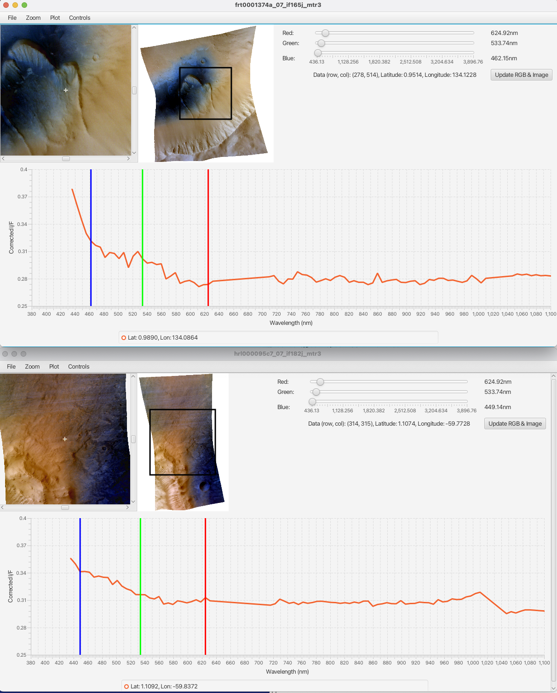

# JCATvis
This is a modified version of the Java CRISM Analysis Tool (JCAT), specialized for analyzing visual bands of MTRDR images.

Forked from https://github.com/JHUAPL/JCAT

Originally based on: http://crism.jhuapl.edu/JCAT version 1.0.2 released Jan 14 2020

Modified to add custom I/F correction in the 380 - 1100nm VNIR range as that range is TOA I/F (top of atmosphere reflectance calibrated).
Only 1100 - 3900nm uses true I/F in the original JCAT, based on volcano scan in JCAT.

Runs on JavaFX 8 and 17, for example Zulu JRE FX 17.

```
usage: ./jcatvis.sh [-c CALFILE] IMGFILE [IMGFILE...]
  -c CALFILE: CVS file to read spectrum of white surface for calibration from.
              Example: src/main/resources/resources/calib/frt000128f3_07_if165j_mtr3_spectrum_soil.csv
  IMGFILE: MRO CRISM *_if*_mtr3.img file(s)
```

Map-based search to download CRISM hyperspectral Images: https://ode.rsl.wustl.edu/mars/mapsearch

You need the following set of data files for each MTRDR hyperspectral map-projected image to load:
* `*_if*_mtr3.img`
* `*_if*_mtr3.lbl`
* `*_wv*_mtr3.tab`

While the original JCAT also loads non-map-projected TRDR data sets (`*if*s_trr3.img`), this modified version only supports map-projected MTRDR.

Example:
* `hrl0000d349_07_if182j_mtr3.img`
* `hrl0000d349_07_if182j_mtr3.lbl`
* `hrl0000d349_07_wv182j_mtr3.tab`



JCATvis is a free analysis tool for Compact Reconnaissance Imaging Spectrometer for Mars (CRISM) data products. It is released under the MIT license.

## Installation
Clone this repository from the command line:
```
> git clone https://github.com/isenberg/JCATvis.git
```
In the cloned folder ('JCATvis'), run the mkPackage.bash script:
```
> ./mkPackage.bash
```
This script will create two tar files in the 'dist' directory. Expand that tar file either in a finder window or via command line:
```
> tar -xvzf ./dist/JCATvis-XXXX.XX.XX.tar.gz
```
Open runJCAT in your corresponding OS via finder window or command line to start using JCATvis:
``` 
> ./JCATvis-XXXX.XX.XX/unix/runJCAT
```

## Tutorial / Documentation

There is a tutorial PDF available when running JCAT. Under the _Help_ tab, click on the _Tutorial_ button to open the document. 

The _Show Log_ button is useful for debugging.

For true color hyperspectral images: https://github.com/isenberg/improved-color-from-crism

